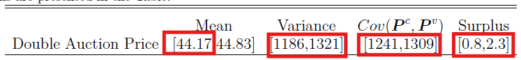
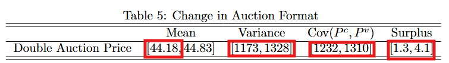
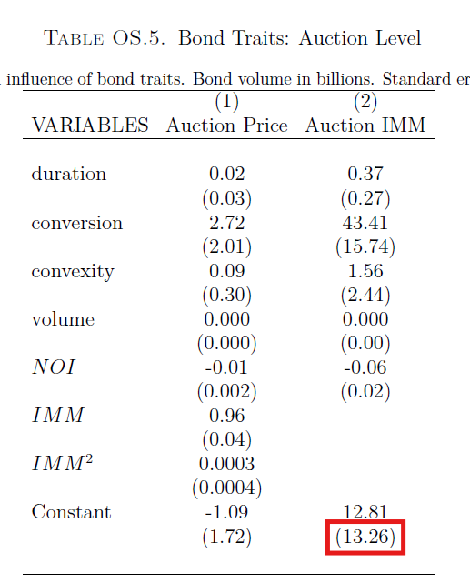
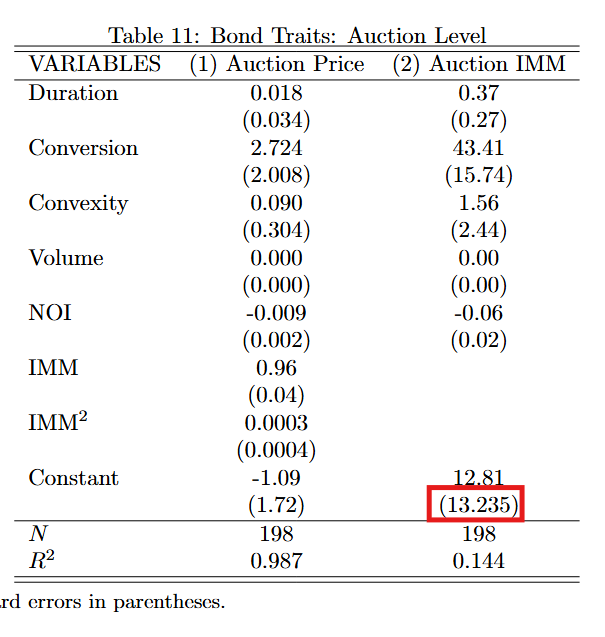
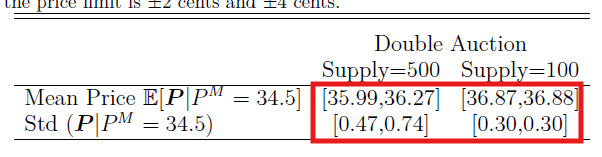
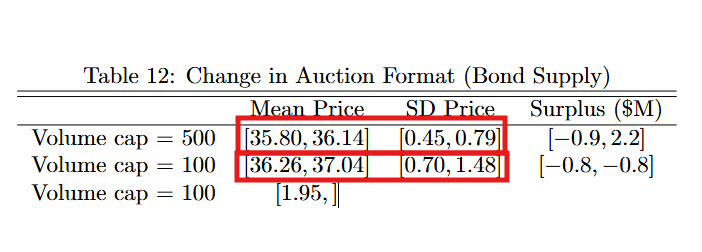

# Paper Identification

|  |  |
|------------------------------------|------------------------------------|
| ID | JPE-Richert-20240555 |
| Author | Richert, Eric |
| Title | Quantity Commitments in Multiunit Auctions: Evidence from Credit Event Auctions |
| Iteration | 4 |

Some useful information up front:

-   [JPE Data and Code Availability Policy](https://www.journals.uchicago.edu/journals/jpe/datapolicy)
-   [Step by step guidance from Data Editor for Authors](https://jpedataeditor.github.io/)
-   [Template README](https://social-science-data-editors.github.io/template_README/)

# Summary

In assessing compliance with our [Data and Code Availability Policy](https://www.journals.uchicago.edu/journals/jpe/datapolicy), our reproducibility team has identified the following issues, which we ask you to address:

1. Table 5 is still not reproduced. Notice that your fix to check for environment with a certain checksum is not working (or it's not the root cause of this discrepancy.)
2. Table OS.5 has a discrepancy for the SE of the intercept, Table OS.6. has significantly different estimates and point estimates. 
3. The messages printed to your console are still not in line with what is printed in the paper.
4. Your approach of blocking any system without AVX512 instructions to execute this is not admissible. While available on most HPC/cloud systems, you basically rule out everybody with a macbook M1/M2 chip to run your package. Intel stopped shipping chips for desktops with AVX512 in 2021 and only came back to it in 2026. Your restriction here is therefore not acceptable. I need you to modify this piece of code and convert the error in your `verify_env` script to a warning. I also need you to document very clearly in your readme, that - despite having the required AVX512 chipset, and the same MATLAB version you required - the JPE Data Editor was not able to reproduce the tables i referenced above. I need this exact reference to us following your instructions here. It is unfortunate for your work, and I am not trying you blame you for it, but it is a fact that those results are reproducibly only under some very peculiar circumstances, which we have not been able to create. This is not great, but it needs to be clearly documented. 
5. I need you to be much more precise when you describe your computer where you produced those results. I want to read "the results in the paper were generated on this exact computing environment" and there you put the full specs of your computer. 
6. After four very heavy rounds of this with my replicator, this will not go back to them. I want you to fix the remaining errors that we found, then the package will be published, with the qualification on items we were not able to reproduce mentioned above.
   

# General

-   [x] Data Availability and Provenance Statements
    -   [x] Statement about Rights - Part 1: Right to use the data (e.g. *did the authors lawfully obtain the data*)
    -   [ ] Statement about Rights - Part 2: Right to publish the data (e.g. *are human subjects involved and did permission been granted to publish their data?*)
    -   [ ] License for Data (optional, but recommended)
    -   [x] Details on each Data Source
-   [x] Dataset list
-   [x] Computational requirements
    -   [x] Software Requirements
    -   [x] Controlled Randomness (as necessary)
    -   [x] Memory, Runtime, and Storage Requirements
-   [x] Description of programs/code
    -   [ ] License for Code (Optional, but recommended)
-   [x] {REPLICATOR} to Replicators
    -   [x] Details (as necessary)
-   [x] List of tables and programs
-   [x] References (Optional, but recommended)

# High-level Description of Research Project

-   [ ] uses observational data.
-   [x] uses *confidential* observational data.
-   [ ] uses data generated via experiment or trial by the authors (in field or lab).
    -   [ ] For lab experiments: The code to implement the experimental protocol (z-Tree, o-Tree etc) is included in the package.
    -   [ ] A PDF copy of IRB approval is contained in the package.
    -   [ ] A PDF document outlining the design of the experiment, including information on the selection and eligibility of participants is included.
    -   [ ] A PDF copy of the instructions given to participants in both original language and an English translation is included.
-   [ ] uses data generated via survey by the authors (in field or online)
    -   [ ] The programs used to administer the survey (e.g. qualtrics survey file) are included.
    -   [ ] A PDF copy of IRB approval is contained in the package.
    -   [ ] A PDF of the original questionaire(s) and information on the selection and eligibility of participants is included.
-   [ ] is a simulation study: the data are generated by an algorithm.
-   [ ] is a numerical illustration: no data are used but code is used to produce illustrative output (tables, figures)

# Data description


For any data that cannot be provided as part of the replication package, please provide the following information as part of the README.

> {REQUIRED} Please specify how long the data will be preserved in the restricted-access location.

> {REQUIRED} Please provide affirmation of support for replication checks. - As per the [JPE policy](https://jpedataeditor.github.io/policy.html), "In cases where data cannot be published in an openly accessible trusted data repository like the JPE dataverse, authors who have requested an exemption to publish them at the time of first submission must commit to preserving the data and code for a period of no less than five years following the publication of the paper. They should also provide reasonable assistance to requests for clarification and replication."

> {REQUIRED} Please provide a codebook for the data. - The codebook should at a minimum describe the variables obtained from the data source, in a manner that will let others verify that they have obtained a substantially similar dataset if successfully obtaining access to the data.

## Data Sources

| file/name | public | private | DOI/URL | Access described | cited readme | cited paper |
|-----------|-----------|-----------|-----------|-----------|-----------|-----------|
| immspreads_clean.csv | no | yes | yes | yes | yes | yes |
| openinterest_clean.csv | no | yes | yes | yes | yes | yes |
| limitorders_clean.csv | no | yes | yes | yes | yes | yes |
| auctionlistid.csv | no | yes | yes | yes | yes | yes |
| bondtypes.csv | no | yes | yes | yes | yes | yes |
| gosyop23q6grk5y1.csv | no | yes | yes | yes | yes | yes |

# Requirements

-   [x] README is in TXT, MD, or PDF format
-   [x] README is accessible at the root of the package (not inside a folder)
-   [x] Title conforms to guidance (starts with "Data and Code for: Title of Paper" or "Code for: Title of Paper", is properly capitalized)
-   [x] Authors (with affiliations) are listed in the same order as on the paper

## Stated Requirements

-   [ ] No requirements specified
-   [x] Software Requirements specified as follows:
    -   MATLAB R2023a
    -   Toolboxes: Statistics and Machine Learning Toolbox, Optimization Toolbox, Parallel Computing Toolbox
-   [x] Computational Requirements specified as follows:
    -   Hardware: 20-core cluster node or 3--4 days desktop
    -   Storage: Sufficient space for large intermediate .mat files
    -   Requires 56GB storage.
-   [x] Time Requirements specified as follows:
    -   approximately 20 hours on a 20-core cluster node, or 3--4 days on a desktop
-   [x] Requirements are complete.

For missing requirements, see the list of required changes in @sec-findings

# Analyzing Data and Code Files











## Code description

There are provided 37 MATLAB, 1 of which is the master script (`code/main_cds.m`).



-   [x] The replication package contains a "main" or "master" file(s) which calls all other auxiliary programs.

## Computing Environment of the Replicator

Hardware:

-   Nuvolos: Ubuntu 24.04.1 LTS, 16 vCPU + 16 GB RAM

Software:

-   Matlab R2023a with Intel compilers

# Replication

-   Downloaded code and data from dropbox.
-   Copied git repo and unzipped the replication package into this repo.
-   Set up the computing environment on Nuvolos and scaled the hardware to 16 vCPU and 64 GB RAM.
-   To address the authors' Conditional Numerical Reproducibility (CNR) requirements, I injected two environment variables into the container's `.bashrc` file (export `MKL_CBWR="AVX512"` and export `MATLAB_DISABLE_CBWR=1`)
-   Modified `code/main_cds.m` to set `ncores = 16` to match the available cluster hardware as instructed in the `README.md`
-   Set working directory and ran the code with MatLab 2023a as per `README.md`
-   Committed changes

# Findings {#sec-findings}

## Data Preparation Code

-   Program `main_cds.m` ran without errors. Output as expected with some differences due to MatLab version.

## Tables and Figures

| Figure/Table \#   | Program                | Line Number | Reproduced?      |
|-------------------|------------------------|-------------|------------------|
| Figure 1A         | normalize_prices.m     | 458         | Yes              |
| Figure 1B         | normalize_prices.m     | 469         | Yes              |
| Figure 3          | /                      |             | Yes              |
| Figure 4 (left)   | postestimation_clean.m | 395         | Yes              |
| Figure 4 (middle) | postestimation_clean.m | 408         | Yes              |
| Figure 4 (right)  | postestimation_clean.m | 416         | Yes              |
| Table 1           | data_summary.m         | 130         | Yes              |
| Table 2           | data_summary.m         | 158         | Yes              |
| Table 3           | normalize_prices.m     | 263         | Yes              |
| Table 4           | postestimation_clean.m | 219         | Yes              |
| Table 5           | postmain_cfs.m         | 76          | No, see @fig-5   |
| Table A.1         | normalize_prices.m     | 437         | Yes              |
| Table OS.1        | data_summary.m         | 77          | Yes              |
| Table OS.2        | data_summary.m         | 305         | Yes              |
| Table OS.3        | data_summary.m         | 200         | Yes              |
| Table OS.4        | normalize_prices.m     | 326         | Yes              |
| Table OS.5        | normalize_prices.m     | 379         | No, see @fig-OS5 |
| Table OS.6        | main_cds.m             | 153         | No, see @fig-OS6 |
| Figure OS.3       | bondprices.m           | 69          | Yes              |
| Figure OS.4       | data_summary.m         | 356         | Yes              |
| Figure OS.5       | data_summary.m         | 334         | Yes              |
| Figure OS.6       | robustnesschecks.m     | 25, 31      | Yes              |
| Figure OS.7       | firststagebidding.m    | 97          | Yes              |
| Figure OS.8       | postestimation_clean.m | 330         | Yes              |

-   `Table 3.tex` presents a small issue with the character `\\$` for lines 10, 11, 12, 13, and 14.

-   Table 5: estimates do not match

::: {#fig-5 layout-ncol="2"}




Table OS.5
:::

::: {#fig-OS5 layout-ncol="2"}




Table OS.5
:::

-   Table OS.6: estimates do not match

::: {#fig-OS6 layout-ncol="2"}




Table OS.6
:::

## In-Text Numbers

| In-text numbers | Program | Line Number | Reproduced? |
|------------------|------------------|------------------|------------------|
| Section 2 \| Sample descriptives (N auctions, N bidders, NOI, etc.) | normalize_prices.m |  | No |
| Section 2 \| Price cap statistic | firststagebidding.m |  | Yes |
| Section 6.1 \| Status quo surplus bounds | calculate_surplusraw.m |  | Yes |
| Section 6.1 \| Truthful bidding surplus bounds | postestimation_clean.m |  | Yes |
| Section 6.2 \| Price bias (cents, %) | postestimation_clean.m |  | Yes |
| Section 6.3 \| Risk SD, hedging effectiveness | postestimation_clean.m |  | Yes |
| Section 6.4 \| Gain from full insurance | postestimation_clean.m |  | No |
| Section 7 \| CF surplus, price bias, hedging | postmain_cfs.m |  | No |
| Appendix C.2 \| Risk aversion comparison | riskaversion.m |  | Yes |
| Appendix C.5.1 \| Truthful reporting incentives | truthfulpimmcheck.m |  | Yes |
| Appendix C.5.1 \| Quote manipulation calibration | round1_quotescalibration.m |  | Yes |
| Appendix C.6 \| Customer orders robustness | robustnesschecks.m |  | Yes |
| Appendix C.7 \| Bid shading with positions | postestimation_clean.m |  | Yes |
| Appendix D \| CF robustness (volume caps, positions) | smc_cfs_yin.m |  | No |

-   [ ] In-text numbers not verified.

-   [ ] There are no in-text numbers, or all in-text numbers stem from tables and figures.

-   [ ] There are in-text numbers, but they are not identified in the code

-   For Section 2, the log prints don't match one of the in-text numbers:

    -   "Twenty five percent of bidders submit a first stage quantity order."

    ```         
    ========== SECTION 2: In-Text Descriptive Statistics ==========
    Fraction bidders submitting first stage quantity: 42.8%
    ```

-   For Section 6.4, the log prints don't match one of the in-text numbers:

    -   "they would charge 1.8 basis points more for CDS coverage on a firm with a 2% default probability."

    ```         
    ========== SECTION 6.4: CDS Market Impact ==========
    Auction bias charge (basis points): 1.9 bps
    ```

-   For Section 7, the log prints don't match one of the in-text numbers. Mean price, variance, covariance, and price bias are now close (small, computing-environment-level differences as the author describes), but the surplus bound is not:

    -   "The counterfactual leads to total surplus \$\[0.8,2.3\]M."

    ```         
     ========== SECTION 7: Counterfactual Surplus ==========
    Mean surplus ($M) [LB, UB]: [1.3, 4.1]
    Max surplus ($M) [LB, UB]: [2.6, 7.9]
    Min surplus ($M) [LB, UB]: [-0.1, 0.5]
    ```

-   For Appendix D.3, the log prints don't match in-text numbers. Unlike Section 7, neither the price nor the std dev range improved in this run:

    -   "leads to expected prices of \[35.26,35.46\] and standard deviations of \[0.93,1.18\]"

    ```         
    ========== APPENDIX D.3: Counterfactual with Changes in Positions ==========
    Expected price: [35.01, 35.23]
    Std dev:        [1.36, 1.52]
    ```

# Classification

-   [ ] full reproduction
-   [x] full reproduction with minor issues
-   [ ] partial reproduction (see above)
-   [ ] not able to reproduce most or all of the results (reasons see above)

## Reason for incomplete reproducibility

-   [ ] None.
-   [x] `Discrepancy in output` (either figures or numbers in tables or text differ)
-   [ ] `Bugs in code` that were fixable by the replicator (but should be fixed in the final deposit)
-   [ ] `Code missing`, in particular if it prevented the replicator from completing the reproducibility check
    -   [ ] `Data preparation code missing` should be checked if the code missing seems to be data preparation code
-   [ ] `Code not functional` is more severe than a simple bug: it prevented the replicator from completing the reproducibility check
-   [ ] `Software not available to replicator` may happen for a variety of reasons, but in particular (a) when the software is commercial, and the replicator does not have access to a licensed copy, or (b) the software is open-source, but a specific version required to conduct the reproducibility check is not available.
-   [ ] `Insufficient time available to replicator` is applicable when (a) running the code would take weeks or more (b) running the code might take less time if sufficient compute resources were to be brought to bear, but no such resources can be accessed in a timely fashion (c) the replication package is very complex, and following all (manual and scripted) steps would take too long.
-   [ ] `Data missing` is marked when data *should* be available, but was erroneously not provided, or is not accessible via the procedures described in the replication package
-   [ ] `Data not available` is marked when data requires additional access steps, for instance purchase or application procedure.
-   [ ] `Missing README` is marked if there is no README to guide the replicator, or the README is not in compliance with JPE requirements
