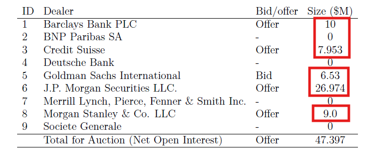
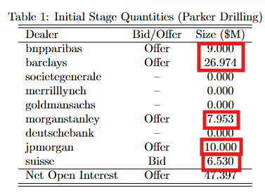
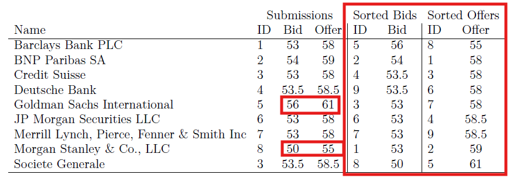
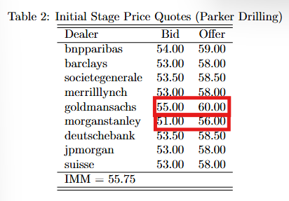
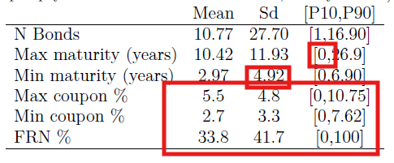
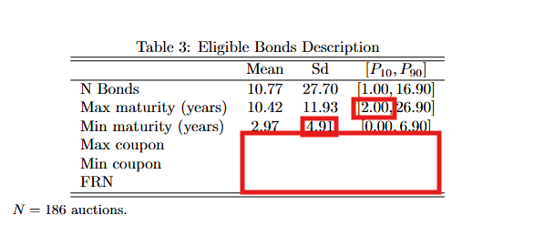

# Paper Identification

|  |  |
|-------------------------|-----------------------------------------------|
| ID | JPE-Richert-20240555 |
| Author | Richert, Eric |
| Title | Quantity Commitments in Multiunit Auctions: Evidence from Credit Event Auctions |
| Iteration | 1 |

Some useful information up front:

-   [JPE Data and Code Availability
    Policy](https://www.journals.uchicago.edu/journals/jpe/datapolicy)
-   [Step by step guidance from Data Editor for
    Authors](https://jpedataeditor.github.io/)
-   [Template
    README](https://social-science-data-editors.github.io/template_README/)

# Summary

In assessing compliance with our [Data and Code Availability
Policy](https://www.journals.uchicago.edu/journals/jpe/datapolicy), our
reproducibility team has identified the following issues, which we ask
you to address:

# General

-   [x] Data Availability and Provenance Statements
    -   [x] Statement about Rights - Part 1: Right to use the data (e.g.
        *did the authors lawfully obtain the data*)
    -   [ ] Statement about Rights - Part 2: Right to publish the data
        (e.g. *are human subjects involved and did permission been
        granted to publish their data?*)
    -   [ ] License for Data (optional, but recommended)
    -   [x] Details on each Data Source
-   [x] Dataset list
-   [x] Computational requirements
    -   [x] Software Requirements
    -   [x] Controlled Randomness (as necessary)
    -   [x] Memory, Runtime, and Storage Requirements
-   [x] Description of programs/code
    -   [ ] License for Code (Optional, but recommended)
-   [x] {REPLICATOR} to Replicators
    -   [x] Details (as necessary)
-   [x] List of tables and programs
-   [x] References (Optional, but recommended)

# High-level Description of Research Project

-   [ ] uses observational data.
-   [x] uses *confidential* observational data.
-   [ ] uses data generated via experiment or trial by the authors (in
    field or lab).
    -   [ ] For lab experiments: The code to implement the experimental
        protocol (z-Tree, o-Tree etc) is included in the package.
    -   [ ] A PDF copy of IRB approval is contained in the package.
    -   [ ] A PDF document outlining the design of the experiment,
        including information on the selection and eligibility of
        participants is included.
    -   [ ] A PDF copy of the instructions given to participants in both
        original language and an English translation is included.
-   [ ] uses data generated via survey by the authors (in field or
    online)
    -   [ ] The programs used to administer the survey (e.g. qualtrics
        survey file) are included.
    -   [ ] A PDF copy of IRB approval is contained in the package.
    -   [ ] A PDF of the original questionaire(s) and information on the
        selection and eligibility of participants is included.
-   [ ] is a simulation study: the data are generated by an algorithm.
-   [ ] is a numerical illustration: no data are used but code is used
    to produce illustrative output (tables, figures)

# Data description

> {REPLICATOR} If the project has any confidential or restricted data,
> please leave the following statements here. If not, delete until next
> heading (`## Data Sources`).

For any data that cannot be provided as part of the replication package,
please provide the following information as part of the README.

> {REQUIRED} Please specify how long the data will be preserved in the
> restricted-access location.

> {REQUIRED} Please provide affirmation of support for replication
> checks. - As per the [JPE
> policy](https://jpedataeditor.github.io/policy.html), "In cases where
> data cannot be published in an openly accessible trusted data
> repository like the JPE dataverse, authors who have requested an
> exemption to publish them at the time of first submission must commit
> to preserving the data and code for a period of no less than five
> years following the publication of the paper. They should also provide
> reasonable assistance to requests for clarification and replication."

> {REQUIRED} Please provide a codebook for the data. - The codebook
> should at a minimum describe the variables obtained from the data
> source, in a manner that will let others verify that they have
> obtained a substantially similar dataset if successfully obtaining
> access to the data.

## Data Sources

| file/name | public | private | DOI/URL | Access described | cited readme | cited paper |
|-----------|-----------|-----------|-----------|-----------|-----------|-----------|
| immspreads_clean.csv | no | yes | yes | yes | yes | yes |
| openinterest_clean.csv | no | yes | yes | yes | yes | yes |
| limitorders_clean.csv | no | yes | yes | yes | yes | yes |
| auctionlistid.csv | no | yes | yes | yes | yes | yes |
| bondtypes.csv | no | yes | yes | yes | yes | yes |
| gosyop23q6grk5y1.csv | no | yes | yes | yes | yes | yes |

# Requirements

-   [x] README is in TXT, MD, or PDF format
-   [x] README is accessible at the root of the package (not inside a
    folder)
-   [ ] Title conforms to guidance (starts with "Data and Code for:
    Title of Paper" or "Code for: Title of Paper", is properly
    capitalized)
-   [x] Authors (with affiliations) are listed in the same order as on
    the paper

> {REQUIRED} Please review the title of the deposit as per our
> guidelines.

## Stated Requirements

-   [ ] No requirements specified
-   [x] Software Requirements specified as follows:
    -   MATLAB R2023a
    -   Toolboxes: Statistics and Machine Learning Toolbox, Optimization
        Toolbox, Parallel Computing Toolbox
-   [x] Computational Requirements specified as follows:
    -   Hardware: 20-core cluster node or a standard multi-core desktop
    -   Storage: Sufficient space for large intermediate .mat files (up
        to \~700 MB for smc_cfs_np.mat)
-   [x] Time Requirements specified as follows:
    -   approximately 20 hours on a 20-core cluster node, or 3--4 days
        on a desktop
-   [x] Requirements are complete.

For missing requirements, see the list of required changes in
@sec-findings

# Analyzing Data and Code Files











## Code description

There are provided 37 MATLAB, 1 of which is the master script
(`code/main_cds.m`).



-   [x] The replication package contains a "main" or "master" file(s)
    which calls all other auxiliary programs.

## Computing Environment of the Replicator

Hardware:

-   Nuvolos: Ubuntu 24.04.1 LTS, 4 vCPU + 16 GB RAM

Software:

-   Matlab R2025b

# Replication

-   Downloaded code and data from dropbox.
-   Copied git repo and unzipped the replication package into this repo.
-   Set up the computing environment on Nuvolos and scaled the hardware
    to 16 vCPU and 64 GB RAM.
-   Set working directory and ran the code as per README.
-   Modified `code/main_cds.m` to set `ncores = 16` to match the
    available cluster hardware as instructed in the `README.md`
-   Ran the code as per the README, but code broke executing the Step 1
    caused by line 68 of `bondpriceimport.m`

```{text}
Error using  : 
Colon operands must be real scalars.

Error in bondpriceimport (line 68)
    for jk=1:size(bonddlocs)
            ^
Error in main_cds (line 58)
bondpriceimport
^^^^^^^^^^^^^^^
```

-   Committed the repo at this exact broken state to preserve the
    generated error log file
-   Substituted this bit of code on line 68 of `bondpriceimport.m`:

``` text
for jk=1:size(bonddlocs)
```

-   With this:

```         
for jk=1:length(bonddlocs)
```

-   Ran code and got a new error:

```{text}
Error using  : 
Colon operands must be real scalars.

Error in acrossrounds (line 43)
for aa=1:size(aucidfslist)
        ^
Error in firststagebidding (line 89)
acrossrounds
^^^^^^^^^^^^
Error in data_summary (line 97)
firststagebidding
^^^^^^^^^^^^^^^^^
Error in main_cds (line 65)
    data_summary
    ^^^^^^^^^^^^
```

-   Committed changes with the new log output. Then, proceeded with
    substituting the bit of code on line 43 of `acrossrounds.m`:

``` text
for aa=1:size(aucidfslist)
```

-   With this:

```         
for aa=1:length(aucidfslist)
```

-   Hit another error:

```{text}
Error using  : 
Colon operands must be real scalars.

Error in data_summary (line 240)
   for ia=1:size(tempBlist)
           ^
Error in main_cds (line 65)
    data_summary
    ^^^^^^^^^^^^
```

-   Committed changes with the new log output. Then, proceeded with
    substituting the bit of code on line 240 of `data_summary.m`:

``` text
for ia=1:size(tempBlist)
```

-   With this:

```         
for ia=1:length(tempBlist)
```

-   Error seems to be systematic in all scripts. Aborted correction and
    started evaluating output obtained so far after this error message:

```{text}
Error using :
Colon operands must be real scalars.

Error in data_summary (line 256)
for ia=1:size(tempBlist)
^
Error in main_cds (line 65)
data_summary
^^^^^^^^^^^^
```

-   Committed changes

# Findings {#sec-findings}

Error message caused by line 68 of `bondpriceimport.m`

After fix, error message cause by line 43 of `acrossrounds.m`.

After fix, error message cause by line 240 and then 256 of
`data_summary.m`.

Probably, other scripts present the same issue. See committed log for
more details.

## Data Preparation Code

-   Program `main_cds.m` stopped after encountering error. Output not as
    expected.

## Tables and Figures

| Figure/Table \#   | Program                | Line Number | Reproduced? |
|-------------------|------------------------|-------------|-------------|
| Figure 1A         | normalize_prices.m     | 458         | No          |
| Figure 1B         | normalize_prices.m     | 469         | No          |
| Figure 3          | /                      |             | No          |
| Figure 4 (left)   | postestimation_clean.m | 395         | No          |
| Figure 4 (middle) | postestimation_clean.m | 408         | No          |
| Figure 4 (right)  | postestimation_clean.m | 416         | No          |
| Table 1           | data_summary.m         | 130         | Yes         |
| Table 2           | data_summary.m         | 158         | Yes         |
| Table 3           | normalize_prices.m     | 263         | No          |
| Table 4           | postestimation_clean.m | 219         | No          |
| Table 5           | postmain_cfs.m         | 76          | No          |
| Table A.1         | normalize_prices.m     | 437         | No          |
| Table OS.1        | data_summary.m         | 77          | Yes         |
| Table OS.2        | data_summary.m         | 305         | No          |
| Table OS.3        | data_summary.m         | 200         | Yes         |
| Table OS.4        | normalize_prices.m     | 326         | No          |
| Table OS.5        | normalize_prices.m     | 379         | No          |
| Table OS.6        | main_cds.m             | 153         | No          |
| Figure OS.3       | bondprices.m           | 69          | Yes         |
| Figure OS.4       | data_summary.m         | 356         | No          |
| Figure OS.5       | data_summary.m         | 334         | No          |
| Figure OS.6       | robustnesschecks.m     | 25, 31      | No          |
| Figure OS.7       | firststagebidding.m    | 97          | Yes         |
| Figure OS.8       | postestimation_clean.m | 330         | No          |

-   Figure OS3: Looks the same but the scaling in the reproduced figure
    is not 1:1 for both axes.

-   Figure OS7: Looks the same but the scaling in the reproduced figure
    is not 1:1 for both axes as in the original.

-   Table 1: output looks different.

::: {#fig-table1 layout-ncol="2"}




Table 1
:::

-   Table 2: output looks different and some results are missing.

::: {#fig-table2 layout-ncol="2"}




Table 2
:::

-   Table OS.1: output looks different and some results are missing.

::: {#fig-tableOS1 layout-ncol="2"}




Table OS.1
:::

## In-Text Numbers

| In-text numbers | Program | Line Number | Reproduced? |
|-----------------------|-----------------|-----------------|-----------------|
| Section 2 \| Sample descriptives (N auctions, N bidders, NOI, etc.) | normalize_prices.m |  | No |
| Section 2 \| Price cap statistic | firststagebidding.m |  | Yes |
| Section 6.1 \| Status quo surplus bounds | calculate_surplusraw.m |  | No |
| Section 6.1 \| Truthful bidding surplus bounds | postestimation_clean.m |  | No |
| Section 6.2 \| Price bias (cents, %) | postestimation_clean.m |  | No |
| Section 6.3 \| Risk SD, hedging effectiveness | postestimation_clean.m |  | No |
| Section 7 \| CF surplus, price bias, hedging | postmain_cfs.m |  | No |
| Appendix C.2 \| Risk aversion comparison | riskaversion.m |  | No |
| Appendix C.5.1 \| Truthful reporting incentives | truthfulpimmcheck.m |  | No |
| Appendix C.5.1 \| Quote manipulation calibration | round1_quotescalibration.m |  | No |
| Appendix C.6 \| Customer orders robustness | robustnesschecks.m |  | No |
| Appendix C.7 \| Bid shading with positions | postestimation_clean.m |  | No |
| Appendix D \| CF robustness (volume caps, positions) | smc_cfs_yin.m |  | No |

-   [ ] In-text numbers not verified.

-   [ ] There are no in-text numbers, or all in-text numbers stem from
    tables and figures.

-   [x] There are in-text numbers, but they are not identified in the
    code

-   Identification in README is ambiguous.

-   Section 2 in the case of Price cap statistic probably identifies to
    "Table 1 illustrates \[...\] there is an excess supply, of
    \$47.397M" on page 8 which is correctly stated from Table 1.

-   On page 9 we have "\[...\] the IMM of 55.75 in the example" which
    matches with results in Table 2.

-   The rest of in-text numbers have not been checked because the
    replication did not output the rest of tables and figures.

## Other Issues

-   Title of the Readme not formatted as in the guidelines.

# Classification

-   [ ] full reproduction
-   [ ] full reproduction with minor issues
-   [ ] partial reproduction (see above)
-   [x] not able to reproduce most or all of the results (reasons see
    above)

## Reason for incomplete reproducibility

-   [ ] None.
-   [x] `Discrepancy in output` (either figures or numbers in tables or
    text differ)
-   [ ] `Bugs in code` that were fixable by the replicator (but should
    be fixed in the final deposit)
-   [ ] `Code missing`, in particular if it prevented the replicator
    from completing the reproducibility check
    -   [ ] `Data preparation code missing` should be checked if the
        code missing seems to be data preparation code
-   [x] `Code not functional` is more severe than a simple bug: it
    prevented the replicator from completing the reproducibility check
-   [ ] `Software not available to replicator` may happen for a variety
    of reasons, but in particular (a) when the software is commercial,
    and the replicator does not have access to a licensed copy, or (b)
    the software is open-source, but a specific version required to
    conduct the reproducibility check is not available.
-   [ ] `Insufficient time available to replicator` is applicable
    when (a) running the code would take weeks or more (b) running the
    code might take less time if sufficient compute resources were to be
    brought to bear, but no such resources can be accessed in a timely
    fashion (c) the replication package is very complex, and following
    all (manual and scripted) steps would take too long.
-   [ ] `Data missing` is marked when data *should* be available, but
    was erroneously not provided, or is not accessible via the
    procedures described in the replication package
-   [ ] `Data not available` is marked when data requires additional
    access steps, for instance purchase or application procedure.
-   [ ] `Missing README` is marked if there is no README to guide the
    replicator, or the README is not in compliance with JPE requirements
